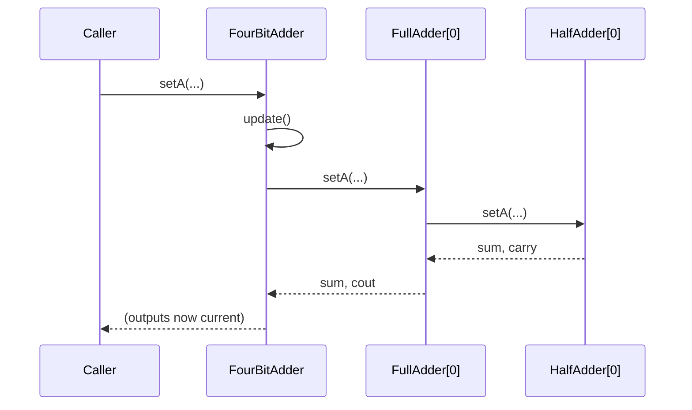

# design/

Your UML class diagram and sequence diagrams go here. This is rubric item 5 (10%), and the diagrams come up again during the in-class session — see §7 and §9 of the assignment handout.

## What's required

**One UML class diagram** covering every class from `AbstractDevice` through `FourBitAdder`, showing both inheritance ("is-a") and composition ("part-of"). Your documentation generator may be able to produce this — check that what it emits is actually complete before relying on it.

**At least two sequence diagrams**, hand-authored, showing behavior rather than structure:

1. What happens when one input pin changes on a composite device — the cascade of `update()` calls down through the objects it's composed of.
2. An addition end to end, including how a carry propagates from the low bit to the high bit.

## Format — required, not a preference

**Your diagrams must be committed in a plain-text format:** [Mermaid](https://mermaid.js.org/) (recommended), PlantUML, or Graphviz.

Your submission is a single text bundle (§10 of the handout). A diagram that exists only as a `.png`, `.jpg`, `.svg`, or `.drawio` file **cannot be read by anyone grading it** — the bundler lists such files by name and skips their contents. An image-only diagram scores nothing on this item, no matter how good it is.

Drawing in a GUI tool is fine *provided you also commit a text version*. After running `munger.py`, check the `FILES NOT BUNDLED` section: if anything in `design/` is listed there, fix it before you submit.

Mermaid is recommended because it's diffable in git, renders natively in `.md` files on GitHub, and travels inside the bundle as readable text.

A Mermaid sequence diagram looks like this:

````

````

That's a sketch of the notation, not a model answer — yours needs to reflect the objects *you* actually built, at enough depth to show where the work happens and how the carry gets from one full-adder to the next.

## A note on these specifically

A class diagram can be generated. A sequence diagram of your own implementation mostly cannot — it requires knowing what your objects actually do to each other at runtime. That's deliberate: it's the deliverable hardest to produce without understanding the system, which is also why you'll be asked to update one in class.
