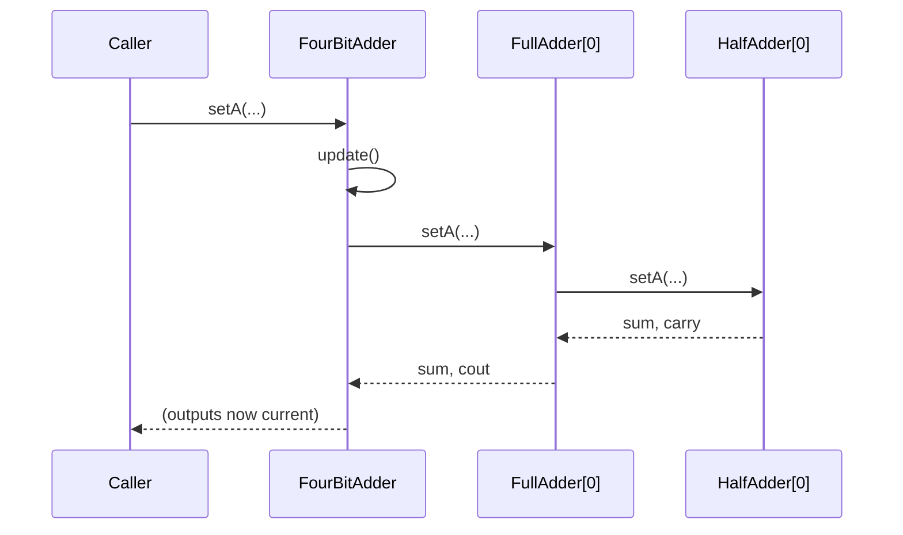

# design/

Your UML class diagram and sequence diagrams go here. This is rubric item 5 (10%), and the diagrams come up again during the in-class session — see §7 and §9 of the assignment handout.

## What's required

**One UML class diagram** covering every class from `AbstractDevice` through `FourBitAdder`, showing both inheritance ("is-a") and composition ("part-of"). Your documentation generator may be able to produce this — check that what it emits is actually complete before relying on it.

**At least two sequence diagrams**, hand-authored, showing behavior rather than structure:

1. What happens when one input pin changes on a composite device — the cascade of `update()` calls down through the objects it's composed of.
2. An addition end to end, including how a carry propagates from the low bit to the high bit.

## Format

Prefer plain text. [Mermaid](https://mermaid.js.org/) is recommended: it's diffable in git, renders natively in `.md` files on GitHub, and — importantly for this course — it travels inside your submission bundle as readable text. PlantUML works too. A drawing tool is acceptable, but a PNG/SVG export won't be readable inside the bundle (§10), so commit the source alongside it.

A Mermaid sequence diagram looks like this:

````

````

That's a sketch of the notation, not a model answer — yours needs to reflect the objects *you* actually built, at enough depth to show where the work happens and how the carry gets from one full-adder to the next.

## A note on these specifically

A class diagram can be generated. A sequence diagram of your own implementation mostly cannot — it requires knowing what your objects actually do to each other at runtime. That's deliberate: it's the deliverable hardest to produce without understanding the system, which is also why you'll be asked to update one in class.
