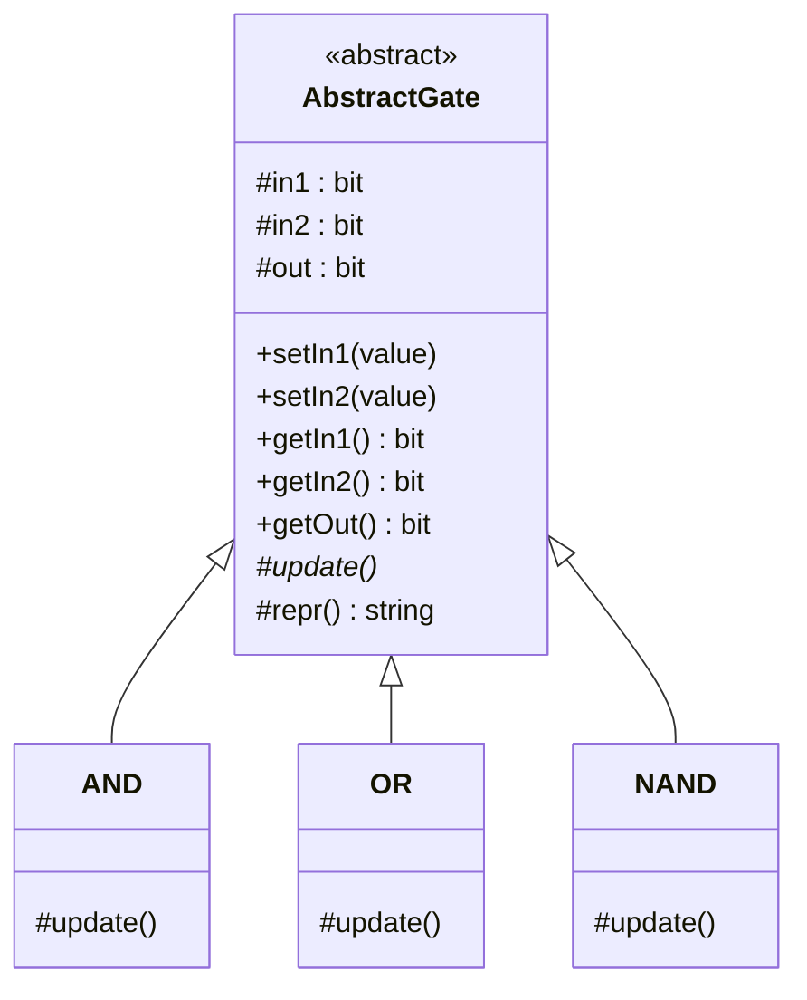
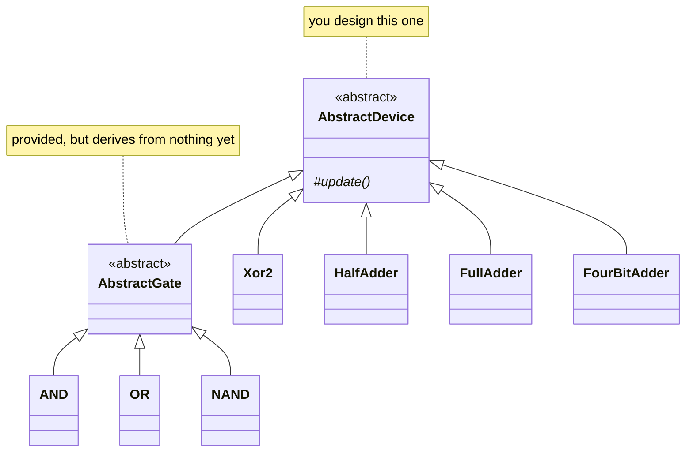
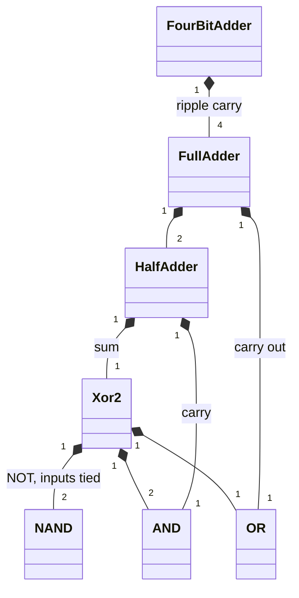

# The starter architecture

A map of what you are given and what you build on top of it. This is orientation, not a
substitute for §5 of the handout — that section is the authoritative specification.

> **This is not your rubric item 5 diagram.** What follows sketches the *shape* the system has to
> take. Your own UML must document the system *you actually build*: your class names, your member
> functions, your composition multiplicities, and how you resolved the `AbstractDevice` contract.
> Copying this diagram back as your own submission would be documenting a design you didn't make.

## What you are given

Two files, in `source/FourBitAdder/intern/`. Between them they define the abstract gate and the
three primitives that everything else in the system must be composed from.

`update()` is abstract on `AbstractGate` and concrete on each primitive. **Those three
implementations are the only place in the entire system where real boolean logic may be written.**
Everything above them is composition.

Note what is *missing* from that picture: `AbstractGate` derives from nothing. Giving it a parent
is your first task.

## What you build

`AbstractGate`, `AND`, `OR`, and `NAND` come with the starter. `AbstractDevice`, `Xor2`,
`HalfAdder`, `FullAdder`, and `FourBitAdder` are yours to write.

Two things to notice, because they are most of rubric item 6:

**`AbstractDevice` sits above `AbstractGate`, not beside it.** A gate has two inputs and one
output. A full-adder has three inputs and two; a four-bit adder has nine and five. They cannot
share the gate's pin shape, but they must share its guarantee — that setting an input recomputes
the outputs before anyone can read them. That guarantee is what `AbstractDevice` exists to state.

**The composites derive from `AbstractDevice` directly.** A `HalfAdder` is not a kind of gate. It
*contains* gates. Which brings us to the other half of the picture.

## The "part-of" hierarchy

Inheritance is only half the canonical view. This is the composition side — what contains what,
and how many:

Read it upward from the primitives and it is the whole assignment: two NANDs with their inputs tied give you NOT,
five primitives give you XOR, an XOR and an AND give you a half-adder, two half-adders and an OR
give you a full-adder, and four full-adders chained by their carries give you the adder.

`Xor2` earns its place here rather than being wired inline inside `HalfAdder`: it is a distinct
level of organization, it gets its own tests, and a design that names its parts is a design you
can extend.

## Where each class lives

| Class | File | Status |
|---|---|---|
| `AbstractGate` | `source/FourBitAdder/intern/AbstractGate.pseudo` | provided |
| `AND`, `OR`, `NAND` | `source/FourBitAdder/intern/LogicGates.pseudo` | provided |
| `AbstractDevice` | you decide | **you build** — no placeholder exists |
| `Xor2`, `HalfAdder`, `FullAdder` | `source/FourBitAdder/intern/` | **you build** |
| `FourBitAdder` | `source/FourBitAdder/intern/FourBitAdder.pseudo` | **you build** |
| public entry point | `source/FourBitAdder/FourBitAdder.pseudo` | **you build** |

Remember that the `.pseudo` files are an outline in pseudocode. Your submission must be real,
running, tested code in a language of your choice — see §3 of the handout.

## Suggested order

Each step is a natural commit boundary, and each one is testable before you move on:

1. Translate `AbstractGate` and the three primitives; get `TestLogicGates` passing for real.
2. Design `AbstractDevice`; retrofit `AbstractGate` to derive from it. Tests still pass.
3. `Xor2`, with its own truth-table test.
4. `HalfAdder`, then `FullAdder`, testing each.
5. `FourBitAdder`, with the exhaustive 512-case sweep.

If you find yourself writing a boolean operator anywhere outside `AND`, `OR`, and `NAND`, stop —
that is the rule the whole exercise rests on.
